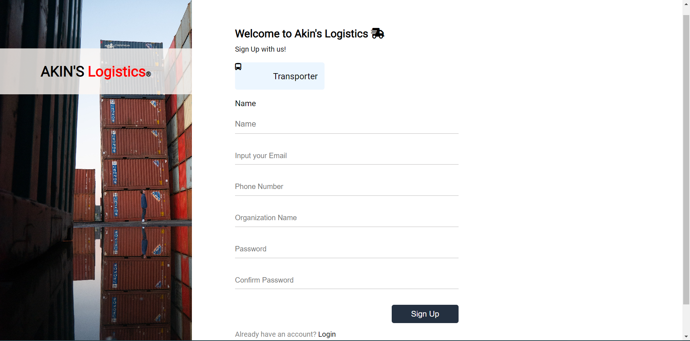

# - A Responsive Login and Sign Up page --- MY WEEKEND CHALLENGE 

This is just a duplicate/clone design of movam.ng website. Weekends challenge aimed at improving my coding skills by building realistic projects(duplicating). 

## Table of contents

- [Overview](#overview)
  - [The challenge](#the-challenge)
  - [Screenshot](#screenshot)
  - [Links](#links)
- [My process](#my-process)
  - [Built with](#built-with)
  - [What I learned](#what-i-learned)
  - [Continued development](#continued-development)
  

## Overview

### The challenge

Users should be able to:

- View the optimal layout for the page depending on their device's screen size
- See hover states for all interactive elements on the page

### Screenshot
 [Reference website design](https://movam.ng/login/transporter)

My designs

Please kindly checkout the design folder for all the screen sizes designs.

### Links

- Solution URL: [Here is the solution URL](https://github.com/SpaceSTech/login-and-sign-up-page.git)
- Live Site URL: [Here is the live site URL](https://spacestech.github.io/login-and-sign-up-page/signup.html)
- Live Site URL: [Here is the live site URL](https://spacestech.github.io/login-and-sign-up-page/Login.html)

## My process

### Built with

- Semantic HTML5 markup
- CSS custom properties
- Flexbox
- CSS Grid

### What I learned

The proper use of styling using Flexbox.

### Continued development

I will be adding a few javascript soon and some animations to the page using css or js. 
### Useful resources

